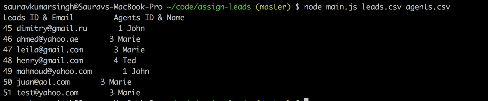
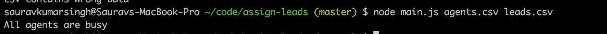
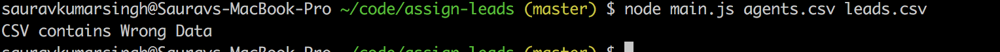

# Assign Leads


### Programing Langauage used

1) Node 12

### File structure
```
-- .assign-leads
    |-- src
        |-- assignLeads.js (contains lead assign method)
    |-- main.js (contain entry point)
    |-- docker-compose.yml
    |-- Dockerfile (building image)
    |-- package-lock.json (contain locked dependency with version)
    |-- README.md (contain information about app like how to setup and use)
    |-- test
    	|-- assignLeadsTest.js (contains test for assign lead to ageant method)
    	|-- fixture (contains testing files)
    
```
### How to run
* Docker way
```
1) Go inside dir assign-leads
1) docker-compose build
2) docker-compose up
```

* Normal way
```
1) Install node
2) git clone repo
3) cd assign-leads
4) npm i
5) node main.js agents.csv leads.csv
```

### Assumptions

1) Weight will alway be positive and greater than zero
2) ID should be postive and greater than zero


### Output Example

1) When csv are valid
  

2) When All agents are busy
  

3) When Invalid CSV
  